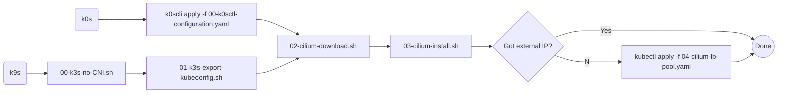

# Single Node

## k0s
- Download [k0scli](https://github.com/k0sproject/k0sctl)
- Run `k0scli apply -f 00-k0scli-configuration.yaml`
  - Using a standard init, with two fields changed:
    - spec.network.kubeproxy.disabled=false
    - spec.network.provider=custom
- Run cilium download and install
- If `<pending>` EXTERNAL_IP run the cilium yaml - _IMPORTANT: edit to add correct ips_

_TODO_: The k0s setup should contain a `01-install-kubectl-export-kubeconfig.sh`

## k3s
Parameters in setup script disables flannel (CNI), kube-proxy, servicelb, network policy and traefik since all of these will be handled by cilium.
`01-k3s-export-kubeconfig.sh` just exports the kube config to ~/.kube/config
- Run both k3s scripts
- Run cilium download and install scripts
- If `<pending>` EXTERNAL_IP run the cilium yaml - _IMPORTANT: edit to add correct ips_
