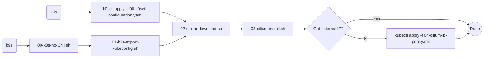

# Single Node

## k0s
- Download [k0scli](https://github.com/k0sproject/k0sctl)
- Run `k0scli apply -f 00-k0scli-configuration.yaml`
- run cilium download and install
- if `<pending>` EXTERNAL_IP run the cilium yaml - _IMPORTANT: edit to add correct ips_

## k3s
- run both k3s scripts
- run cilium download and install scripts
- if `<pending>` EXTERNAL_IP run the cilium yaml - _IMPORTANT: edit to add correct ips_
