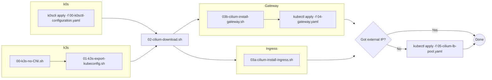

# Kubernetes install with cilium
These scripts contains all commands and configuration needed to install Kubernetes with cilium as CNI, lb and ingress.

The repo will expand as I install more flavours of k8s, and different configurations.

## Single Node
Maybe more Kubernetes flavours will be added at a later point

### Choose your flavour
Choose your flavour of k8s, install and then jump to Cilium install

#### k0s
- Download [k0scli](https://github.com/k0sproject/k0sctl)
- Run `k0scli apply -f 00-k0scli-configuration.yaml`
  - Using a standard init, with two fields changed:
    - `spec.network.kubeproxy.disabled=false`
    - `spec.network.provider=custom`

_TODO_: The k0s setup should contain a `01-install-kubectl-export-kubeconfig.sh` - This need to be done in order to use e.g `k9s`, or just `kubectl` directly, without having to `sodu k0s kubectl`

#### k3s
Parameters in setup script disables flannel (CNI), kube-proxy, servicelb, network policy and traefik since all of these will be handled by cilium.
- Run `./00-k3s-no-CNI.sh`
- Run `./01-k3s-export-kubeconfig.sh` - just exports the kube config to ~/.kube/config

### Cilium
After choosing and installing your flavour of k8s, and disabled the "pre packaged" CNI, lb and ingress controller, install cilium
- Run `./02-cilium-download.sh` and `./03-cilium-install.sh`
- Wait to see cilium getting ready: `cilium status --wait` - This will update the status until nodes are all ready
- If `<pending>` EXTERNAL_IP run `sudo k0s kubectl apply -f 04-cilium-lb-pool.yaml` - _IMPORTANT: edit to add correct ips_

### Flow chart

### Next steps

The current `03-cilium-install.sh` will work as long as you will use the Ingress API, but is currently working on setting up cilium with Gatway API instead.
Initial scripts are submitted, and flowchart is updated, but this is subject to change, as this currently does not work on my server.
